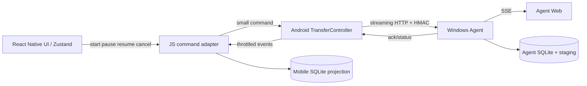

# 文件传输全量重构方案

## 1. 结论与范围

本方案替换当前 `mobile -> Windows Agent` 的文件发送执行层。目标不是调整现有 JS 分块参数，而是把文件 I/O、摘要、HMAC、HTTP、重试和暂停控制从 React Native JS 线程移出。原生执行器不是理论上唯一的实现方式，但在当前 Expo Android 项目中是可控且可验证的实现路径。

**已验证事实**

- 当前移动端发送器在 JS 线程调用 `FileHandle.readBytes`、`@noble/hashes` 和 `fetch`；同一线程还负责 React 渲染、触摸事件和 SQLite 状态更新。
- 当前 Agent 每个分块都返回完整 `TransferTask`，并读取所有已确认块索引；同时立即发布 SSE 事件。高吞吐时会产生不必要的 SQLite 查询、JSON 和 Web 刷新。
- `packages/network` 已是 Expo 原生模块，Android 实现已使用 Kotlin `Coroutine` 和 `Dispatchers.IO`，但只实现了文件 SHA-256，不承担传输。

**合理推断**

连续 JS 分块读取、摘要和签名会阻塞 React Native 事件循环。这足以解释 Agent 已写入分块而 App 仍显示“协商中”、暂停点击迟迟不绘制，以及大文件上传期间界面卡顿。该推断仍需 Android 性能追踪和崩溃日志确认具体内存/CPU占比。

**本次重构范围**

- Android 前台 `mobile -> Agent` 文件传输。
- Agent 接收端、状态查询、确认和控制接口。
- 移动端 SQLite 状态投影与 UI。

不在本次范围：iOS 实现、后台持续传输、Agent -> mobile、端到端加密、自动带宽承诺。

## 2. 必须废弃的边界

下列职责不得继续在 JS 线程执行：

```text
文件读取 -> 分块 SHA-256 -> HMAC -> HTTP PUT -> 重试 -> 断点索引 -> 最终 SHA-256
```

JS 只保留：选择文件、创建任务元数据、订阅原生事件、批量写 SQLite、渲染 UI、派发用户命令。运行期间 UI 只订阅内存投影；SQLite 只保存可恢复快照，禁止两者相互回写。



## 3. 新协议：V3

V1/V2 接口保留给历史任务，不与 V3 任务混用。新移动端先签名请求能力接口：

```text
GET /v1/transport/capabilities
-> { protocols: [1, 2, 3], maxChunkBytes, maxInFlightChunks }
```

只在 Agent 声明 V3 时创建 V3 任务；否则 UI 显示“接收端需更新”，不得静默降级为 JS 上传器。

### 3.1 创建

```text
POST /v3/transfers
{
  transferId, sourceDeviceId, items: [{ itemId, name, mimeType, sizeBytes }],
  chunkSizeBytes, protocol: 3
}
```

- 文件完整 SHA-256 不在创建时提供。
- Agent 返回不可变的 `chunkSizeBytes`、`revision`、已确认范围和状态。
- 新任务使用原生控制器选择的保守初值，例如 1 MiB、2 个在途请求；控制器根据确认 RTT、失败率和可用内存，在 **后续任务** 上调优。单一任务的分块大小不可变。

### 3.2 分块确认

```text
PUT /v3/transfers/:transferId/items/:itemId/chunks/:chunkIndex
Content-Range: bytes start-end/total
X-FlowDrop-Chunk-Sha256: ...

-> { revision, itemId, chunkIndex, receivedBytes, transferReceivedBytes }
```

响应只返回确认本身，不返回完整任务或全部块索引。`revision` 单调递增，移动端忽略旧 revision，避免并发响应倒退进度。

### 3.3 状态修复与完成

```text
GET /v3/transfers/:transferId/status
-> { revision, status, transferReceivedBytes, items: [{ itemId, receivedRanges }] }

POST /v3/transfers/:transferId/complete
{ files: [{ itemId, contentRoot }] }
```

- 分块 ACK 是正常事件路径；移动端不订阅当前仅供 Web 使用的 SSE。原生控制器只在单个 ACK 超过 `max(3 * RTT, 2 秒)`、收到 5xx、网络变化、从后台回到前台或 1 秒没有 ACK 时查询一次 status，并限制为最多每 5 秒一次。
- status 返回的 revision 仍落后、本地发生超时或网络仍不稳定时进入 `repairMode`，轮询间隔为 500 ms、1 s、2 s、5 s。收到 revision 不低于本地且没有在途故障后立即退出；UI 显示“正在同步传输状态”。任何修复响应只能按 revision 前进，不能无条件覆盖内存投影。
- V3 使用第 3.4 节的 `contentRoot`。恢复时从本地持久化分块摘要和 Agent status 的摘要清单重建根，不重读已确认文件块；缺失摘要才在原生 I/O 线程读取对应块补齐。
- 完成接口幂等：相同 `contentRoot` 在 `completed` 时返回 200 和最终 revision，在 `completing` 时返回 202 和当前阶段，不重新开始；不同根返回冲突。移动端只在 `completed` 后持久化完成。

完成请求进入 Agent 的同一任务队列，并先把任务写为 `completing`。队列屏障之前已经接收的块必须先 durable 提交；屏障之后的新块一律返回 `TRANSFER_CLOSING`，不得返回含糊的 `TRANSFER_NOT_FOUND`。发送端只在全部块 ACK 后调用完成；收到 `TRANSFER_CLOSING`、冲突或超时后先查询 status/revision 再更新 UI，不能把任务闪回 `transferring`。完成请求超过初始 60 秒仍未返回时，UI 显示“接收端正在确认”，保留状态查询和取消入口；不自动重新创建任务。幂等的同根 complete 可以由用户重试，绝不提供跳过校验的“强制完成”。

认证继续使用当前 HMAC 语义。V3 不将明文 HTTP 误表述为保密传输。Kotlin 与 Node 必须共用固定测试向量，逐字节验证 `method`、`path`、`timestamp`、`nonce`、请求体 SHA-256 和最终签名；创建 JSON 需使用确定的字段顺序或明确的规范化序列化。

### 3.4 可恢复的内容根

不能把各分块的 SHA-256 拼接或再次哈希后称为“文件 SHA-256”：SHA-256 不可由子块摘要还原。V3 改用独立定义的 `contentRoot`，其安全性来自每块内容 SHA-256 与有序摘要列表的 SHA-256，不冒充完整文件摘要。

```text
chunkDigest[i] = SHA-256(chunk bytes)
leaf[i] = SHA-256("FlowDrop-V3-leaf\\0" || u64be(i) || u64be(chunkLength) || chunkDigest[i])
contentRoot = SHA-256("FlowDrop-V3-root\\0" || u64be(fileSize) || u32be(chunkSize) || leaf[0] || ... || leaf[n])
```

- 发送端在原生读取每个块时保存 `(itemId, chunkIndex, byteLength, chunkDigest)`；只在 Agent durable ACK 后将该摘要标为已确认。Agent 已在块表保存相同摘要。
- 启动恢复时，原生控制器优先加载本地摘要；本地缺失时从 V3 status 分页获取 Agent 已确认块摘要。按索引读取这些小记录即可重建 `contentRoot`，无需读取已确认的文件字节。
- Android UI 立即进入 `recovering`，显示“正在恢复传输状态”和“恢复摘要清单 x%”。百分比基于已恢复摘要条目数/总块数，不冒充文件上传进度；原生事件节流上报恢复进度。
- 私有 `flowdrop-outgoing` 暂存文件是 V3 的前提。若摘要清单损坏、旧任务没有摘要或暂存文件不再可信，降级为原生后台完整读取，并显示“正在校验本地文件 x%”；这不会阻塞 UI。
- Agent 在完成屏障后先验证每个块均已确认、由 durable 块记录计算期望 `contentRoot` 并与发送端比较；随后在 worker thread 按相同分块定义重读 `.part`、重建实际 `contentRoot`，二者一致才写入 `completed`。这保留“最终落盘内容被校验”的边界，避免只相信写入前的内存块摘要。worker 每 250 ms 更新 `verifyingBytes/totalBytes` 和阶段，status 与 Web 可显示“正在校验 x%”，主事件循环不被占用。

## 4. Android 原生传输控制器

在现有 `FlowDropNetworkModule` 中增加 `TransferController`，或建立同一 Expo Module 下独立类。Kotlin API：

```text
startTransfer(config) -> operationId
pauseTransfer(transferId)
resumeTransfer(transferId)
cancelTransfer(transferId)
getTransferSnapshot(transferId)

events:
  transferState
  transferProgress
  transferFailure
```

实现要求：

1. 由 Application 级 `CoroutineScope(SupervisorJob() + Dispatchers.IO)` 管理每个任务，禁止绑定 Activity、Fragment、ViewModel 或页面生命周期，也禁止在 React JS 线程读取文件或计算摘要。
2. 使用明确声明的 OkHttp 依赖和流式 `RequestBody`；每个分块在原生固定大小缓冲中读取、计算块 SHA-256、签名和发送，禁止把文件或分块序列化到 JS。
3. 每任务使用 `Semaphore` 控制在途请求。低内存初始值为 2，最高值和分块大小由能力接口限制；内存压力、超时、5xx 或重传时收缩窗口。
4. 文件完整摘要按读取顺序在原生 `MessageDigest` 内维护。上传可并发，但读取/摘要顺序必须确定；暂停后保留当前摘要与已读取位置，应用进程被杀后从头本地重读以重建摘要，已确认块不重传。
5. 每 100 ms 或累计 256 KiB（取先到者）发送一次事件；事件包含 `revision`、`confirmedBytes`、`submittedBytes`、`confirmedRateBytesPerSecond`、状态和错误。事件节流不能影响 Agent ACK。
6. `pause`/`cancel` 先终止原生协程和新请求，再调用 Agent 控制接口。命令事件必须在网络请求之前发给 JS，保证 UI 乐观更新。
7. 页面卸载只取消 JS 事件订阅，不取消原生任务。前台 MVP 在应用进入后台时由 Application 控制器有序暂停；Android 被杀进程后不承诺继续传输。后台持续传输需要单独的 Foreground Service 设计与通知权限评审。
8. 恢复任务先发 `recovering` 事件，再在 I/O 线程加载/校验分块摘要清单；不得因重建完整性状态而阻塞 JS 或 UI 线程。

## 5. Agent 接收端重构

Agent 的 SQLite 仍是接收事实源，但写入模型改为“每任务串行写入队列”：

1. HTTP handler 仅验证认证、范围和块摘要后，把块放入该 `transferId` 的 writer queue。
2. writer 使用异步文件写入；累计最多 4 个块或 20 ms 后在一个 SQLite 事务中写入块记录、已确认字节和 `revision`。
3. 只有事务提交成功才回复各块 ACK，保证“已确认”可恢复。
4. 文件已写入但进程在数据库提交前崩溃时，块会被重传覆盖；不得仅按 `.part` 文件长度推断稀疏/乱序块已确认。
5. `transfer.changed` SSE 改为每任务最多 250 ms 一次的合并通知。Web 收到通知后获取一次快照，避免每块触发完整状态列表刷新。
6. 完成时根据 durable 块记录计算期望 `contentRoot`，再在 worker thread 从最终 `.part` 重建实际 `contentRoot`；实际根一致才进入 `completed`。worker 进度合并进 status/SSE，避免主事件循环阻塞。现有 `node:sqlite` API 是同步调用；批量事务是否仍会阻塞主线程必须通过基准测试决定，超过阈值时将 writer 与数据库访问移入 worker thread，不能仅因使用异步文件 I/O 就假定 Agent 不阻塞。
7. 暂停、取消也进入同一任务队列：先处理已经 durable 的写入，再写终态；随后拒绝未开始的块。这样两端不会因迟到分块重新变为 `transferring`。

## 6. 移动端状态与 UI

Agent 状态是远端真相。移动端状态使用单向投影：原生事件或状态修复先更新 Zustand 内存投影，随后异步、按 revision 写入 SQLite 恢复快照；SQLite 启动恢复后必须等待 Agent revision 修复，不能反向覆盖内存或远端状态。增加字段：

```text
protocol_version, remote_revision, confirmed_bytes, submitted_bytes,
confirmed_rate_bps, pending_operation, last_remote_sync_at,
recovery_state, recovery_manifest_bytes
```

- 主进度显示 `confirmedBytes / totalBytes`，只代表 Agent 已持久化字节。
- 次级信息显示“已确认速率：x MiB/s”。`submittedBytes` 仅在详情中展示，明确标注“等待确认”，不得伪装为完成进度。
- 任何原生事件 revision 小于本地 `remote_revision` 时丢弃；状态和字节只能单调推进，终态优先。Zustand 与 SQLite 不构成双向同步关系。
- UI 点击暂停/继续/取消时，JS 立刻事务写入 `pending_operation` 和目标状态并刷新；原生控制器随后执行。失败时以失败事件携带的 revision 回滚，`TRANSFER_NOT_FOUND` 则按“未在对端创建”规则处理。
- React 页面只订阅 Zustand 内存投影，绝不轮询文件、绝不处理二进制；SQLite 读取只发生在启动恢复和历史记录页。
- 分块摘要使用独立 `outgoing_transfer_chunk_digests` 表，而非 JSON 列；主键为 `(transfer_id, item_id, chunk_index)`，包含长度、摘要、确认 revision 和时间。JS 仅批量持久化原生事件，不能每块同步阻塞渲染。

## 7. 迁移与回滚

1. 发布支持 V3 的 Agent，但继续保留 V1/V2 接收和历史查询。
2. 发布含原生 `TransferController` 的 Android development build。Expo Go 和旧 development build 不支持 V3。
3. 旧 V1/V2 未完成任务显示“旧传输任务，需要重新发送”；继续保留其 Agent 查询、历史和取消能力，但不在新版本执行旧 JS 上传器，避免重新引入已知 UI 卡顿。不得自动变更其分块参数或 `transferId`；用户确认取消后重新创建 V3 任务。
4. 只有能力接口确认 V3 后才启用原生发送器。能力检测失败必须可解释，不得回退到隐式 JS 上传。
5. 发生 V3 协议或原生崩溃时，任务持久化为 `failed` 或 `paused`，保留远端 revision 与已确认范围；重新打开后先状态修复再允许继续。

## 8. 验收标准

以下均需要 Android 真机和 Agent 联调记录，静态检查不能替代：

| 场景 | 可验收结果 |
| --- | --- |
| 100 MiB 视频启动 | 从用户确认发送到本地 UI 显示 `transferring` 不超过 500 ms；该指标不依赖网络或 Agent 响应。动画、返回和暂停按钮可操作。 |
| 上传中暂停 | 点击后 UI 在下一帧显示暂停请求；Agent 在处理已确认写入后同步为 `paused`，后续块不再增加。 |
| 状态一致性 | 移动端 `confirmedBytes` 与 Agent `transferReceivedBytes` 的 revision 最终一致；短暂网络延迟由状态修复收敛。 |
| 断点恢复 | 杀死 App 后重开，立即显示恢复状态和摘要清单进度；先查询 Agent revision/摘要清单，只补发缺块，`contentRoot` 一致。 |
| 完成超时 | 重复同根 complete 不创建重复文件；`completing`、`completed`、冲突和 `TRANSFER_CLOSING` 都按 revision 收敛，UI 不闪回传输中。 |
| 最终落盘校验 | Agent worker 重读 `.part` 并重建 `contentRoot`；校验进度可见，内容根不一致不得完成。 |
| 速度透明 | UI 显示已确认 `MiB/s`；不承诺固定最低速率，记录 Wi-Fi、RTT、Agent 磁盘与设备型号。 |
| 压力 | 1 GiB 文件、暂停/继续/取消、Wi-Fi 断连重连各执行至少三次，无 UI 卡死、无重复完成、无 SQLite 状态倒退。 |

## 9. 实施顺序与风险

1. 先增加 V3 能力接口、最小 ACK 和 revision，不接入 UI。
2. 实现 Android 原生控制器及事件契约，以小文件集成测试验证创建、暂停、取消与断点恢复。
3. 实现 Agent writer queue、ACK 批处理、SSE 去抖与最终 `contentRoot` 校验 worker/进度。
4. 将移动端 UI 切到原生事件投影；历史 V1/V2 任务仅可查询、取消或重新发送，不运行旧执行器。
5. 做真机性能/崩溃测试后，再考虑窗口自适应和后台服务。

主要风险：Android 原生网络栈集成、HMAC 字节级兼容、Expo development build 重新构建、Agent 写入队列顺序、旧任务迁移。当前无法从代码静态推导真实 Wi-Fi 吞吐；所有性能判断必须以设备测试数据为准。
